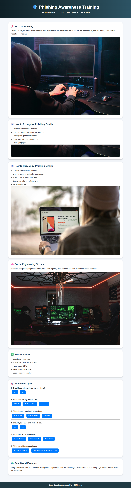

# 🛡️ Phishing Awareness Training
## Project Screenshot


## 📌 Project Description

Phishing Awareness Training is an interactive cybersecurity webpage developed using HTML, CSS, and JavaScript in VS Code. The project helps users understand phishing attacks, identify fake emails and websites, learn social engineering tactics, and follow online safety best practices.

The webpage also includes interactive quizzes and real-world examples to improve cybersecurity awareness in an engaging way.

---

## 🚀 Features

- Interactive cybersecurity training webpage
- Information about phishing attacks
- Fake website detection tips
- Social engineering awareness
- Online safety best practices
- Interactive quizzes with instant answers
- Responsive and user-friendly design

---

## 🛠️ Technologies Used

- HTML
- CSS
- JavaScript
- VS Code

---

## 📂 Project Structure

```text
phishing-awareness/
│
├── index.html
│
├── images/
│   ├── phishing.jpg
│   ├── fakewebsite.jpg
│   └── hacker.jpg
│
└── README.md
▶️ How to Run the Project
Download or clone the repository
Open the project folder in VS Code
Install the Live Server extension
Right click on index.html
Click Open with Live Server
🎯 Learning Outcomes
Understand phishing attacks
Learn to identify suspicious emails
Detect fake websites
Improve cybersecurity awareness
Practice safe online behavior
🌍 Real World Applications

This project can be used for:

Cybersecurity awareness programs
College mini projects
Lab IA demonstrations
Educational presentations
Beginner web development practice
👨‍💻 Author

Developed as a Cybersecurity Awareness Project using VS Code.
